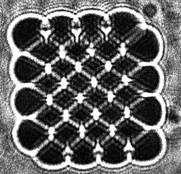

# PhaseVortexGen_iSCAT

## Description
Acousto-Optic deflectors deflect part of the laser beam using vibrating piezo crystals under voltage. Where difference in voltage frequency changes the deflected angle and amplitude changes the intensity of the deflected beam.

By periodically deflecting green laser onto a ruby plate, in such a way that the laser scans through a square while changing amplitude according to the corresponding pixel of some image, we create a heat signature on the plate. 

Heated parts of the plate then have different refraction indeces. And so the red laser passing through the plate creates a phase vortex.

## Setup

