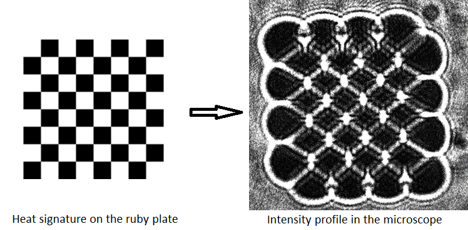

# PhaseVortexGen_iSCAT

## Description
Acousto-Optic deflectors deflect part of the laser beam using vibrating piezo crystals under voltage. Where the voltage frequency determines the deflected angle and amplitude determines the intensity of the deflected part.

By periodically deflecting green laser onto a ruby plate, in such a way that the laser scans through a square while changing amplitude according to the corresponding pixel of some image, we create a heat signature on the plate. 

## Setup
Arduino connects to two [Direct digital synthesisers (DDS)](http://www.aaoptoelectronic.com/our-products/dds-direct-digital-synthesizers/) controlling the output voltage frequency and amplitude. DDSs then connect to corresponding Acousto-Optic deflectors.

As the speed of the sampling rate is crucial to prevent cool down of the ruby plate, we chose to use [Arduino Due](https://docs.arduino.cc/hardware/due) for its high cpu frequency of 84MHz. Using Direct port manipulation we are then able to write to 22 pins (7 bits for each frequency and 8 bits for amplitude) synchronously using just a few clock cycles.

## Usage

### convert.exe
When running this program, you will be asked to input the path of the image you want to convert, the image \<number\> and the output image resolution. Then a file called image\<number\>.h gets created, containing drawing instructions for the arduino, according to the settings set in the "settings.txt" file.
  
The resolution of the output image must always be lower or equal 128x128.
  
### amp_control_fast.ino
This program includes a file image1.h and is compiled and uploaded into the arduino, which then draws the image using the deflectors.
  
### amp_control_multiple-imgs.ino
This program includes files image\<number\>.h, where number goes from 1 to 9, and draws the corresponding image. You can change the image being drawn by selecting a corresponding number on the keypad connected to the arduino.

You can then measure the drawing performance using \# button on the keypad. The information gets printed to the corresponding serial port with bitrate 9600bps.
  
## Settings
  
### Loop_unrolling
An optimization in drawing. Greatly increases the compile time and decreases the drawing time. With this option enabled we usually get a sampling rate of ~35MHz, compared to ~7MHz  when disabled.
  
### Drawing mode
#### Line_by_line
Draw the image line by line. This option works the best in our setup.
#### Randomizing
Draw the pixels in random order.
#### Segment_random
Randomly go through segments of the image and draw the pixels in random order inside.
  
### Number_of_segmentations
Number of segmentations when using mode Segment_random.
  
### Blur_when_resizing
When enabled, resized image is blurred using linear interpolation.
  
### Remove_zeros
Skips the drawing of pixels with intensity 0.
  
### Slow_down_drawing
Artificially slow down drawing.
  
### Go_back_and_forth
Every even frame gets drawn in the opposite direction, so the position of the deflected beam always changes continuosly when using Line_by_line drawing mode.
  
### Full_FOV
When using lower resolutions, the image is still drawn in the full field of view of the deflectors.

## Compilation
We surprisingly found out that our programs for arduino give the best performance while using optimization flag "-Og" when compiling.
